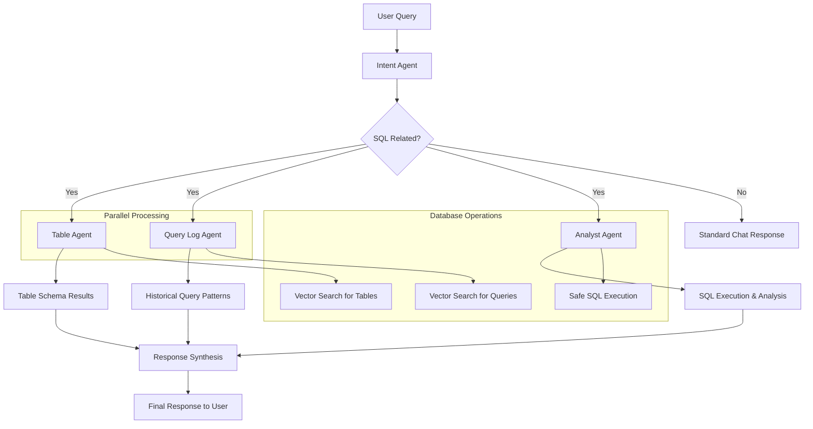

# Squeel - Agentic SQL Analysis System

<p align="center">
    An intelligent SQL analysis system powered by AI agents that work together to provide comprehensive database insights and query assistance.
</p>

<p align="center">
  <a href="#overview"><strong>Overview</strong></a> ·
  <a href="#agentic-workflow"><strong>Agentic Workflow</strong></a> ·
  <a href="#agents-in-detail"><strong>Agents in Detail</strong></a> ·
  <a href="#how-it-works"><strong>How It Works</strong></a> ·
  <a href="#setup"><strong>Setup</strong></a>
</p>

## Overview

Squeel is an advanced SQL analysis system that uses multiple AI agents working in coordination to provide intelligent database query assistance. The system automatically classifies user questions, identifies relevant database tables, searches historical query patterns, and executes safe SQL queries with detailed analysis.

## Agentic Workflow

The system employs a sophisticated multi-agent architecture where each agent has a specialized role:



## Agents in Detail

### 1. Intent Agent
**Location**: `lib/ai/agents/intent-agent.ts`

**Purpose**: Classifies user queries and determines if they're SQL-related

**Key Functions**:
- Analyzes user messages to determine if they involve SQL, databases, or data queries
- Maps queries to business domains (finance, sales, marketing, HR, etc.)
- Provides confidence scores and reasoning for classifications
- Distinguishes between system-defined and custom business domains

**Output**: Intent classification with business domain mapping and confidence scores

### 2. Table Agent
**Location**: `lib/ai/agents/table-agent.ts`

**Purpose**: Identifies relevant database tables and columns using semantic search

**Key Functions**:
- Uses embedding similarity to find relevant tables
- Searches across database schemas using vector similarity
- Filters results by collection/database ID
- Groups results by table name with column details
- Provides table relevance scores

**Tools**:
- `find_relevant_tables`: Semantic search for database tables using embeddings

**Output**: Structured information about relevant tables, columns, and their relationships

### 3. Query Log Agent
**Location**: `lib/ai/agents/query-log-agent.ts`

**Purpose**: Searches historical query patterns for similar use cases

**Key Functions**:
- Finds similar historical queries using embedding similarity
- Filters by query type (SELECT, INSERT, UPDATE, DELETE)
- Categorizes queries by semantic meaning
- Provides actual SQL code examples from historical logs
- Analyzes query complexity and patterns

**Tools**:
- `find_relevant_queries`: Semantic search for historical SQL queries using embeddings

**Output**: Historical query patterns with SQL examples and complexity analysis

### 4. Analyst Agent
**Location**: `lib/ai/agents/analyst-agent.ts`

**Purpose**: Executes SQL queries safely and provides comprehensive analysis

**Key Functions**:
- Validates SQL queries for safety (only SELECT operations allowed)
- Executes queries with timeouts and resource limits
- Generates performance insights and optimization suggestions
- Provides query execution statistics
- Offers concrete recommendations based on results

**Tools**:
- `execute_sql_query`: Safe SQL execution with analysis
- `analyze_query_performance`: Performance analysis and optimization suggestions

**Safety Features**:
- Query validation to prevent dangerous operations
- Connection pooling with limits
- 30-second query timeout
- Resource usage monitoring

## How It Works

### 1. Query Classification
When a user submits a question, the **Intent Agent** first analyzes it to determine:
- Is this SQL-related?
- What business domains are relevant?
- What's the confidence level?

### 2. Parallel Information Gathering
If the query is SQL-related, two agents work in parallel:

**Table Agent**:
- Generates embeddings for the user's question
- Searches vector database for similar table schemas
- Returns relevant tables with column information

**Query Log Agent**:
- Searches historical query embeddings
- Finds similar past queries with actual SQL code
- Provides patterns and complexity analysis

### 3. Query Execution & Analysis
The **Analyst Agent** takes the results from the previous agents and:
- Synthesizes table schema information with historical patterns
- Generates and executes safe SQL queries
- Provides performance analysis and optimization suggestions
- Generates insights based on query results

### 4. Response Synthesis
The system combines all agent outputs to provide:
- Relevant table schemas and relationships
- Historical query patterns and examples
- Executed query results with analysis
- Performance recommendations
- Suggested alternative approaches

## Key Features

### Safety & Security
- **Query Validation**: Only SELECT queries are allowed
- **Timeout Protection**: 30-second execution limit
- **Resource Limits**: Connection pooling and resource monitoring
- **Dangerous Keyword Filtering**: Prevents harmful operations

### Performance Optimization
- **Parallel Agent Execution**: Table and Query Log agents run simultaneously
- **Vector Search**: Fast semantic similarity search for tables and queries
- **Connection Pooling**: Efficient database connection management
- **Query Performance Analysis**: Automatic optimization suggestions

### Business Domain Intelligence
- **Domain Mapping**: Automatic classification into business domains
- **Collection Filtering**: Support for multiple database collections
- **Historical Pattern Learning**: Learns from successful query patterns
- **Context-Aware Responses**: Tailored responses based on business context

## Setup

### Prerequisites
- Node.js 18+
- PostgreSQL database
- Supabase account (for vector embeddings)
- Azure OpenAI API access

### Environment Variables
```bash
POSTGRES_URL=your_postgres_connection_string
SUPABASE_URL=your_supabase_url
SUPABASE_ANON_KEY=your_supabase_anon_key
AZURE_OPENAI_API_KEY=your_azure_openai_key
AZURE_OPENAI_ENDPOINT=your_azure_openai_endpoint
```

### Installation
```bash
npm install
npm run dev
```

### Database Setup
The system requires vector embeddings stored in Supabase with the following functions:
- `match_table_embeddings`: For table schema search
- `match_query_embeddings`: For historical query search

## Development Mode Authentication Bypass

For easier development and testing, the application includes an authentication bypass feature:

- **Development Mode**: Automatic mock user session, no OAuth setup required
- **Production Mode**: Full authentication flow with configured OAuth providers
- **Quick Start**: Simply run `npm run dev` and access `localhost:3000`

## Example: Real Agent Workflow

Here's a real example of how the agents work together to answer the question **"how much is the largest account?"**

### 1. Intent Agent Classification
```json
{
  "isSqlRelated": true,
  "confidence": 0.9,
  "businessDomains": [
    { "domain": "finance", "relevance": 0.8, "workspaceType": "system" },
    { "domain": "analytics", "relevance": 0.6, "workspaceType": "system" }
  ],
  "reasoning": "The question is SQL-related as it involves retrieving data about accounts, likely from a database. The finance domain is relevant due to the context of accounts, while analytics is relevant for data analysis."
}
```

### 2. Table Agent Results
**Found 3 relevant tables** with semantic similarity scores:

```javascript
[
  {
    table_name: 'accounts',
    db_id: 'small_bank_1',
    columns: [
      { column_name: 'name', column_type: 'text' },
      { column_name: 'customer_id', column_type: 'integer' }
    ],
    similarity: 0.358711085242699
  },
  {
    table_name: 'checking',
    db_id: 'small_bank_1', 
    columns: [
      { column_name: 'balance', column_type: 'numeric' }
    ],
    similarity: 0.316891548077741
  },
  {
    table_name: 'savings',
    db_id: 'small_bank_1',
    columns: [
      { column_name: 'balance', column_type: 'numeric' }
    ],
    similarity: 0.311994355202072
  }
]
```

**Table Agent Analysis**:
- Identified `checking` and `savings` tables contain balance information
- Suggested queries for finding largest balances across account types
- Recommended UNION approach for cross-table comparison

### 3. Query Log Agent Results
```javascript
{
  queries: [],
  searchQuery: "largest account balance maximum",
  resultsCount: 0,
  selectedCollection: "small_bank_1"
}
```

**Query Log Agent Response**:
- No historical queries found for this specific pattern
- Provided SQL query recommendations based on table structure
- Suggested multiple approaches with performance tips

### 4. Analyst Agent Execution
**Executed 2 SQL queries in parallel**:

**Query 1**: `SELECT MAX(balance) AS largest_checking_balance FROM checking;`
- **Result**: $10,000.00
- **Execution time**: 269ms
- **Row count**: 1

**Query 2**: `SELECT MAX(balance) AS largest_savings_balance FROM savings;`
- **Result**: $15,000.00  
- **Execution time**: 558ms
- **Row count**: 1

**Analyst Agent Insights**:
- Fast query execution (< 1 second for both)
- Well-optimized queries
- Clear comparison between account types
- Recommendations for JOIN queries if customer details needed

### 5. Final Synthesis
The system combined all agent outputs to provide:
- **Answer**: Largest account balance is $15,000.00 (from savings)
- **Context**: Comparison between checking ($10,000) and savings ($15,000)
- **SQL Examples**: Multiple query approaches with explanations
- **Performance Analysis**: Fast execution times indicate good optimization
- **Recommendations**: Suggestions for extended queries with customer information

This example demonstrates how the multi-agent system provides comprehensive analysis beyond just answering the question, including context, alternatives, and optimization insights.

## Agent Prompts and Tool Calling

### 1. Intent Agent - Structured Object Generation

**Model**: `gpt-4o-mini` (Azure OpenAI)  
**Type**: `generateObject` with Zod schema validation

**Prompt System**:
```
You are an expert at classifying user questions and mapping them to business domains for SQL query assistance.

Your task is to:
1. Determine if the user's question is SQL-related (involves databases, tables, data exploration, data queries, analytics, reporting, etc.)
2. If SQL-related, identify which business domains/workspaces are most relevant
3. Classify workspaces as either "system" (predefined business areas) or "custom" (user-specific domains)

Available business domains:
- finance: Financial data, accounting, budgets, revenue, expenses
- sales: Sales performance, leads, deals, customer acquisition
- marketing: Campaigns, leads, conversion rates, marketing metrics
- hr: Employee data, payroll, performance, recruitment
- operations: Business processes, logistics, supply chain
- inventory: Stock levels, product management, warehousing
- customer-service: Support tickets, customer satisfaction, service metrics
- analytics: General data analysis, reporting, dashboards
- custom: User-specific or industry-specific domains not covered above

Guidelines:
- Mark as SQL-related if the question involves: data retrieval, database queries, reporting, analytics, data analysis, table operations
- For system workspaces: use predefined domains that clearly match the question
- For custom workspaces: when the domain is very specific to user's business or not well covered by system domains
- Provide relevance scores (0-1) for each domain
- Include confidence score for overall classification
- Be concise but clear in reasoning
```

**Output Schema**:
```typescript
{
  isSqlRelated: boolean,
  confidence: number, // 0-1
  businessDomains: Array<{
    domain: 'finance' | 'sales' | 'marketing' | 'hr' | 'operations' | 'inventory' | 'customer-service' | 'analytics' | 'custom',
    relevance: number, // 0-1
    workspaceType: 'system' | 'custom'
  }>,
  reasoning: string
}
```

### 2. Table Agent - Tool-Based Search

**Model**: `gpt-4o` (Azure OpenAI)  
**Type**: `generateText` with tools, `maxSteps: 2`

**System Prompt**:
```
You are a database schema expert. Your job is to help users find relevant database tables and columns.

When the user asks about database tables, you MUST:
1. ALWAYS use the find_relevant_tables tool first to search for relevant tables
2. After getting the results, provide a clear, helpful response that explains:
   - Which tables are most relevant to their question
   - What columns are available in those tables
   - How the tables could be used to answer their question
   - Suggest potential SQL queries if appropriate

You MUST call the find_relevant_tables tool before providing any response.
```

**Available Tools**:
```typescript
find_relevant_tables: {
  description: "Search for relevant database tables using embedding similarity",
  parameters: {
    query: string, // The search query to find relevant tables
    limit?: number, // Maximum number of tables to return (default: 5)
    table_name?: string // Optional specific table name to filter results
  },
  execute: async ({ query, limit = 5, table_name }) => {
    // 1. Generate embedding for search query
    // 2. Call Supabase RPC: match_table_embeddings
    // 3. Filter by collection ID and table name
    // 4. Group results by table name with columns
    // 5. Return formatted table information with similarity scores
  }
}
```

### 3. Query Log Agent - Historical Pattern Search

**Model**: `gpt-4o` (Azure OpenAI)  
**Type**: `generateText` with tools, `maxSteps: 2`

**System Prompt**:
```
You are a SQL query expert. Your job is to help users find relevant SQL queries from historical query logs.

When the user asks about SQL queries, database operations, or data analysis, you MUST:
1. ALWAYS use the find_relevant_queries tool first to search for similar queries
2. After getting the results, provide a clear, helpful response that explains:
   - Which historical queries are most relevant to their question
   - What patterns or approaches were used in similar queries
   - Show actual SQL code examples from the query logs when available
   - How these queries could be adapted for their specific needs
   - Explain the complexity and semantic category of the queries
   - Compare different SQL approaches found in the logs
   - Suggest modifications or improvements based on the historical patterns

The query logs contain both descriptive text (query_text) and actual SQL code (sql_query). Use both to provide comprehensive examples and explanations.
```

**Available Tools**:
```typescript
find_relevant_queries: {
  description: "Search for relevant SQL queries from query logs using embedding similarity",
  parameters: {
    query: string, // The search query to find relevant SQL queries
    limit?: number, // Maximum number of queries to return (default: 5)
    query_type?: string, // Optional filter by query type (SELECT, INSERT, UPDATE, DELETE)
    category?: string // Optional filter by semantic category
  },
  execute: async ({ query, limit = 5, query_type, category }) => {
    // 1. Generate embedding for search query
    // 2. Call Supabase RPC: match_query_embeddings
    // 3. Filter by collection ID, query type, and category
    // 4. Format results with SQL code, complexity scores, and metadata
    // 5. Return historical query patterns with similarity scores
  }
}
```

### 4. Analyst Agent - SQL Execution and Analysis

**Model**: `gpt-4o` (Azure OpenAI)  
**Type**: `generateText` with tools, `maxSteps: 5`

**System Prompt**:
```
You are an expert SQL analyst with deep database knowledge. Your role is to analyze database schemas, execute SQL queries safely, and provide meaningful insights from the results.

## Your Task:
1. Analyze the provided table schema and query logs
2. Generate and execute SQL queries to answer the user's question
3. Provide insights and recommendations based on the results
4. Ensure all queries are safe and optimized

## Guidelines:
- Only execute SELECT queries - no data modification allowed
- Analyze query performance and suggest optimizations
- Provide clear explanations of the results
- Suggest alternative approaches when applicable
- Use insights from historical queries to inform your analysis
- Include relevant business context in your analysis

You MUST use the execute_sql_query tool to run queries and analyze results. Always explain your approach and findings.
```

**Available Tools**:
```typescript
execute_sql_query: {
  description: "Execute a SQL query safely and return results with analysis",
  parameters: {
    query: string, // The SQL SELECT query to execute
    purpose: string // Brief explanation of what this query is trying to accomplish
  },
  execute: async ({ query, purpose }) => {
    // 1. Validate query (only SELECT allowed)
    // 2. Create database connection with limits
    // 3. Execute query with 30-second timeout
    // 4. Generate performance insights
    // 5. Return results with analysis and recommendations
  }
}

analyze_query_performance: {
  description: "Analyze query performance and suggest optimizations",
  parameters: {
    query: string, // The SQL query to analyze
    executionTime: number, // Query execution time in milliseconds
    rowCount: number // Number of rows returned
  },
  execute: async ({ query, executionTime, rowCount }) => {
    // 1. Analyze execution time thresholds
    // 2. Check for performance anti-patterns
    // 3. Suggest query optimizations
    // 4. Return performance score and recommendations
  }
}
```

### Tool Calling Flow

1. **Intent Agent**: No tools - uses structured generation to classify queries
2. **Table Agent**: Single tool call to `find_relevant_tables` → Response with table analysis
3. **Query Log Agent**: Single tool call to `find_relevant_queries` → Response with historical patterns
4. **Analyst Agent**: Multiple tool calls:
   - Primary: `execute_sql_query` (can be called multiple times)
   - Secondary: `analyze_query_performance` for optimization analysis

### Safety and Validation

**Query Validation** (Analyst Agent):
```typescript
const validateQuery = (query: string): { isValid: boolean; error?: string } => {
  const trimmedQuery = query.trim().toLowerCase();
  
  // Must be SELECT only
  if (!trimmedQuery.startsWith('select')) {
    return { isValid: false, error: 'Only SELECT queries are allowed' };
  }
  
  // Block dangerous keywords
  const dangerousKeywords = [
    'drop', 'delete', 'insert', 'update', 'alter', 'truncate',
    'create', 'grant', 'revoke', 'exec', 'execute', 'call',
    'declare', 'merge', 'replace', 'rename', 'comment'
  ];
  
  // Additional validation logic...
}
```

**Connection Management**:
- Maximum 5 concurrent connections
- 30-second idle timeout
- 10-second connection timeout
- 30-second query execution timeout

## Architecture Benefits

### Modularity
Each agent has a single responsibility, making the system maintainable and extensible.

### Scalability
Agents can be scaled independently based on workload requirements.

### Accuracy
Multiple specialized agents provide more accurate and comprehensive responses than a single general-purpose agent.

### Safety
Multi-layer validation ensures safe query execution and prevents harmful operations.

### Learning
The system learns from historical query patterns to improve future recommendations.
