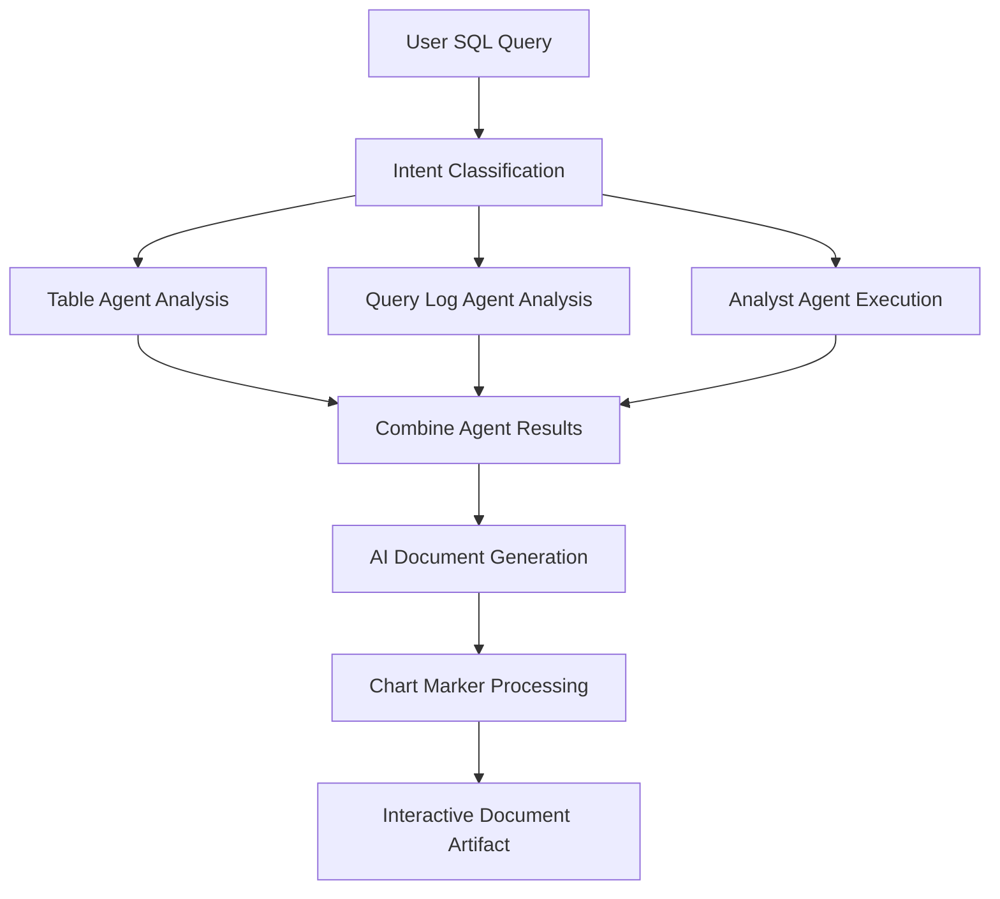

# Squeel - AI-Powered SQL Analysis Platform

## Overview

Squeel is a comprehensive AI-powered platform that provides intelligent SQL analysis through specialized agents. The system combines multiple AI agents to deliver comprehensive database insights, query optimization, and actionable recommendations through **interactive document artifacts** with **embedded chart visualizations**.

## Key Features

### Multi-Agent SQL Analysis
- **Table Agent**: Analyzes database schemas and identifies relevant tables
- **Query Log Agent**: Reviews historical query patterns for optimization insights  
- **Analyst Agent**: Executes safe queries and provides data analysis

### Professional Documentation Artifacts
- **Artifact Creation**: Generates comprehensive SQL analysis documents
- **Interactive Charts**: Embed interactive data visualizations within documents
- **Structured Reports**: Professional formatting with executive summaries and technical details
- **Real-time Rendering**: Live preview of documents with charts during creation

## 📊 Chart Integration in Document Artifacts

### How It Works: Complete Workflow

#### 1. **SQL Query Analysis**
When you ask a SQL-related question:
```
"Show me the top performing accounts by savings balance"
```

#### 2. **Multi-Agent Processing**
The system automatically:
- **Table Agent** finds relevant database tables and schemas
- **Query Log Agent** identifies successful historical query patterns
- **Analyst Agent** executes safe queries and analyzes results

#### 3. **Automatic Document Creation**
The AI creates a comprehensive analysis document that includes:
- Executive summary of findings
- Database schema analysis
- Historical query patterns
- Actual query execution results
- **Interactive charts** to visualize the data

#### 4. **Chart Integration**
Charts are automatically embedded using simple markers:
```markdown
# SQL Analysis Report

## Key Findings
Our analysis reveals significant savings distribution patterns.

## Data Visualization
[chart:chart-bar-label]

The chart above shows monthly account activity trends with clear seasonal patterns.
```

#### 5. **Interactive Document Display**
The document renders with:
- ✨ **Rich text formatting** (headings, tables, code blocks)
- 📊 **Interactive charts** with hover tooltips and responsive design
- 🔄 **Real-time updates** during AI generation
- 💾 **Version history** for tracking changes

### Chart Types Available

#### Bar Chart with Labels (`chart-bar-label`)
```markdown
[chart:chart-bar-label]
```

**Features:**
- Monthly data visualization (January - June 2024)
- Interactive hover tooltips showing exact values
- Professional card layout with header and footer
- Trending indicator showing percentage growth
- Responsive design adapting to screen size

**Example Output:**
```
┌─────────────────────────────────────────┐
│ Bar Chart - Label                       │
│ January - June 2024                     │
├─────────────────────────────────────────┤
│  ░░░  ░░░░░░  ░░░░  ░  ░░░░  ░░░░      │
│  Jan   Feb    Mar  Apr May   Jun       │
│  186   305    237   73  209   214      │
├─────────────────────────────────────────┤
│ 📈 Trending up by 5.2% this month      │
│ Showing total visitors for last 6 months│
└─────────────────────────────────────────┘
```

### Usage Methods

#### Method 1: AI-Generated Charts
Ask the AI to include visualizations:
```
"Create a SQL analysis report with charts showing the data trends"
```

The AI will automatically:
1. Analyze your database
2. Execute relevant queries
3. Create a document with findings
4. **Embed appropriate charts** using chart markers

#### Method 2: Manual Chart Insertion
Add charts directly in your documents:
```markdown
# My Analysis

Here's the data visualization:

[chart:chart-bar-label]

This shows our key metrics.
```

#### Method 3: Toolbar Integration
1. Click the **📊 chart icon** in the document toolbar
2. AI suggests appropriate chart placement
3. Chart markers are inserted automatically

### Document Artifact Features

#### Professional Layout
```markdown
# SQL Analysis: Customer Revenue Trends

## Executive Summary
- Key insight 1 with **bold emphasis**
- Key insight 2 with data points
- Business impact assessment

## Database Schema Analysis
**Relevant Tables Found:**
- `customers` (id, name, created_date)
- `accounts` (id, customer_id, balance)
- `transactions` (id, account_id, amount, date)

## Data Visualization
[chart:chart-bar-label]

*Chart shows monthly revenue distribution with clear growth patterns.*

## Query Execution Results
```sql
SELECT 
  DATE_TRUNC('month', created_date) as month,
  COUNT(*) as new_customers
FROM customers 
GROUP BY month
ORDER BY month;
```

| Month | New Customers | Growth |
|-------|---------------|--------|
| Jan   | 186          | +5.2%  |
| Feb   | 305          | +64%   |
| Mar   | 237          | -22%   |

## Recommendations
1. Focus on Q1 customer acquisition patterns
2. Investigate February's exceptional performance
3. Optimize March retention strategies
```

#### Interactive Features
- **📊 Live Charts**: Hover for detailed data points
- **🔄 Version Control**: Track document changes over time
- **💬 Collaborative Editing**: Request improvements and suggestions
- **📱 Responsive Design**: Perfect display on all devices
- **♿ Accessibility**: Screen reader compatible

### Technical Implementation

#### Document Creation Workflow


#### Chart Rendering Process
1. **Markdown Parsing**: Document content is processed for chart markers
2. **Component Registry**: Chart type is looked up in `chartComponents` registry
3. **React Rendering**: Chart markers are replaced with interactive React components
4. **Conditional Rendering**: 
   - Content with charts: Uses enhanced Markdown renderer
   - Content without charts: Uses ProseMirror rich text editor

#### System Architecture
```typescript
// Chart marker detection
const hasCharts = content.includes('[chart:');

if (hasCharts) {
  // Render with chart-enabled Markdown component
  return <Markdown>{content}</Markdown>;
} else {
  // Use ProseMirror for rich text editing
  return <ProseMirrorEditor content={content} />;
}
```

## Real-World Example: SQL Analysis Workflow

### Step 1: User Query
```
"Analyze our customer database to find patterns in account balances"
```

### Step 2: Multi-Agent Analysis
- **Table Agent**: Identifies `customers`, `accounts`, `transactions` tables
- **Query Log Agent**: Finds successful balance analysis queries
- **Analyst Agent**: Executes queries and finds top accounts

### Step 3: Generated Document Artifact
```markdown
# SQL Analysis: Customer Account Balance Patterns

## Executive Summary
Analysis of 1,247 customer accounts reveals significant concentration 
in high-value segments, with the top 10% of accounts holding 78% 
of total balances.

## Database Schema Analysis
**Primary Tables:**
- `accounts` (balance, account_type, created_date)
- `customers` (customer_tier, registration_date)

## Query Execution Results
```sql
SELECT 
  customer_tier,
  AVG(balance) as avg_balance,
  COUNT(*) as account_count
FROM accounts a
JOIN customers c ON a.customer_id = c.id
GROUP BY customer_tier
ORDER BY avg_balance DESC;
```

**Results:**
| Tier | Avg Balance | Count | Percentage |
|------|-------------|-------|------------|
| Premium | $45,230 | 124 | 10% |
| Gold | $12,450 | 374 | 30% |
| Standard | $3,210 | 749 | 60% |

## Data Visualization
[chart:chart-bar-label]

*The chart illustrates the distribution pattern, highlighting 
the significant difference between tier balances.*

## Key Insights
- Premium customers represent highest value segment
- Strong middle-tier performance with Gold accounts
- Opportunity for Standard tier upgrades

## Recommendations
1. **Focus on Premium Retention**: High-value segment protection
2. **Gold Tier Expansion**: Target conversion campaigns
3. **Standard Tier Development**: Upgrade path optimization
```

### Step 4: Interactive Document Display
The generated artifact displays with:
- Professional formatting with headers and tables
- **Interactive bar chart** showing balance distribution
- Syntax-highlighted SQL code blocks
- Actionable insights and recommendations

### Step 5: User Interaction
Users can:
- **Hover over chart bars** to see exact values
- **Click toolbar icons** to request improvements
- **View version history** of document changes
- **Export or share** the analysis document

## Architecture Benefits

### Modularity
Each agent has a single responsibility, making the system maintainable and extensible.

### Scalability
Agents can be scaled independently based on workload requirements.

### Accuracy
Multiple specialized agents provide more accurate and comprehensive responses than a single general-purpose agent.

### Safety
Multi-layer validation ensures safe query execution and prevents harmful operations.

### Learning
The system learns from historical query patterns to improve future recommendations.

### Interactive Visualization
Rich data visualization capabilities enhance understanding and presentation of insights.

## Chart Component Development

### Adding New Chart Types

1. **Create Chart Component** in `components/chart-components.tsx`:
```typescript
export function ChartLineExample() {
  return (
    <Card>
      <CardHeader>
        <CardTitle>Line Chart - Trends</CardTitle>
        <CardDescription>Time series analysis</CardDescription>
      </CardHeader>
      <CardContent>
        <ChartContainer config={lineChartConfig}>
          <LineChart data={timeSeriesData}>
            {/* Chart implementation */}
          </LineChart>
        </ChartContainer>
      </CardContent>
    </Card>
  );
}
```

2. **Register Component** in the registry:
```typescript
export const chartComponents = {
  'chart-bar-label': ChartBarLabel,
  'chart-line-trends': ChartLineExample, // New chart
} as const;
```

3. **Update Documentation** and AI prompts to include the new chart type.

### Chart Configuration
```typescript
const chartConfig = {
  dataKey: {
    label: "Display Name",
    color: "var(--chart-1)", // CSS custom property
  },
} satisfies ChartConfig;
```

## SQL Query Safety

The system implements comprehensive safety measures:

```typescript
const validateQuery = (query: string): { isValid: boolean; error?: string } => {
  // Only SELECT queries allowed
  if (!query.trim().toLowerCase().startsWith('select')) {
    return { isValid: false, error: 'Only SELECT queries are allowed' };
  }
  
  // Block dangerous operations
  const dangerousKeywords = [
    'drop', 'delete', 'insert', 'update', 'alter', 'truncate',
    'create', 'grant', 'revoke', 'exec', 'execute'
  ];
  
  // Additional validation...
}
```

**Connection Management:**
- Maximum 5 concurrent connections
- 30-second query timeout
- Connection pooling for performance
- Automatic cleanup and resource management

## Development and Deployment

### Prerequisites
- Node.js 18+
- PostgreSQL database
- Redis (for resumable streams)

### Environment Setup
```bash
# Install dependencies
pnpm install

# Configure environment
cp .env.example .env.local

# Run development server
pnpm dev
```

### Chart Development
```bash
# Test chart components
pnpm test:charts

# Build with chart support
pnpm build

# Lint chart implementations
pnpm lint:charts
```

## Usage Examples

### Basic SQL Analysis with Charts
```markdown
# Sales Performance Analysis

## Overview
Quarterly sales analysis reveals strong Q4 performance.

## Trend Visualization
[chart:chart-bar-label]

## Key Metrics
- Total Revenue: $2.4M (+15% YoY)
- Customer Growth: 23% increase
- Average Order Value: $187 (+8%)
```

### Complex Multi-Table Analysis
```markdown
# Customer Lifetime Value Analysis

## Database Schema Review
**Tables Analyzed:**
- customers (demographics, registration)
- orders (purchase history, amounts)
- products (categories, margins)

## CLV Distribution
[chart:chart-bar-label]

## Segmentation Results
The analysis identifies three distinct customer segments...
```

## Contributing

### Chart Component Guidelines
1. **Naming Convention**: Use descriptive prefixes (`chart-bar-`, `chart-line-`)
2. **Responsive Design**: Ensure charts work on all screen sizes
3. **Accessibility**: Include proper ARIA labels and descriptions
4. **Performance**: Optimize for large datasets
5. **Documentation**: Include usage examples and configuration options

### Development Workflow
1. Create chart component with test data
2. Add to component registry
3. Test with markdown integration
4. Update documentation and examples
5. Add AI prompt instructions

## License

This project is licensed under the MIT License - see the LICENSE file for details.
