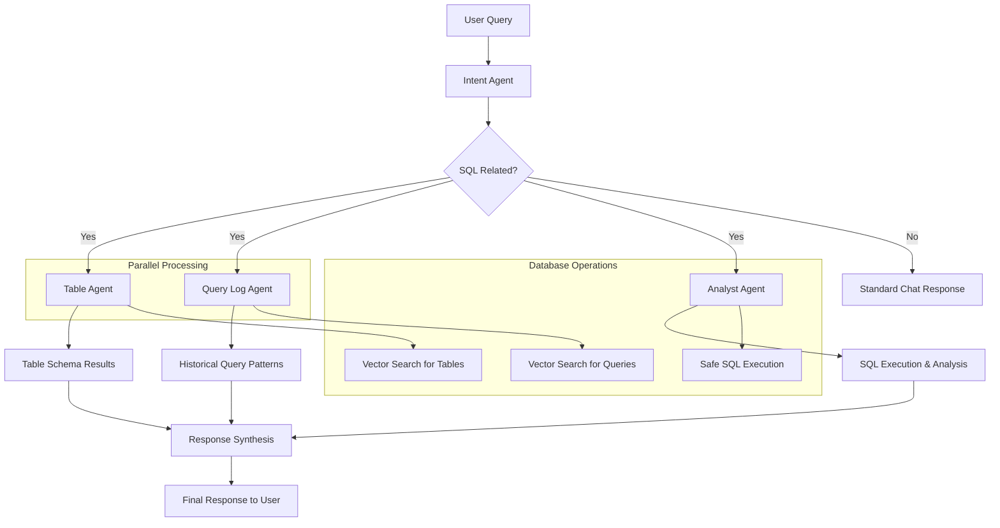
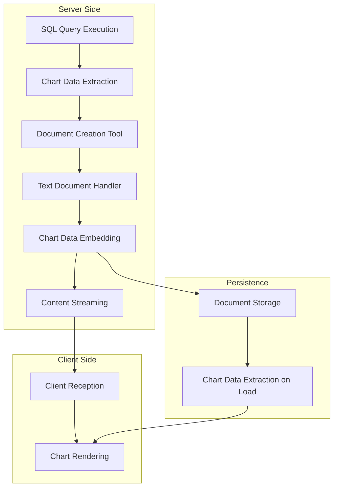

# Squeel - Agentic SQL Analysis System

<p align="center">
    An intelligent SQL analysis system powered by AI agents that work together to provide comprehensive database insights and query assistance.
</p>

<p align="center">
  <a href="#overview"><strong>Overview</strong></a> ·
  <a href="#agentic-workflow"><strong>Agentic Workflow</strong></a> ·
  <a href="#agents-in-detail"><strong>Agents in Detail</strong></a> ·
  <a href="#how-it-works"><strong>How It Works</strong></a> ·
  <a href="#setup"><strong>Setup</strong></a>
</p>

## Overview

Squeel is an advanced SQL analysis system that uses multiple AI agents working in coordination to provide intelligent database query assistance. The system automatically classifies user questions, identifies relevant database tables, searches historical query patterns, and executes safe SQL queries with detailed analysis.

## Agentic Workflow

The system employs a sophisticated multi-agent architecture where each agent has a specialized role:



## Agents in Detail

### 1. Intent Agent
**Location**: `lib/ai/agents/intent-agent.ts`

**Purpose**: Classifies user queries and determines if they're SQL-related

**Key Functions**:
- Analyzes user messages to determine if they involve SQL, databases, or data queries
- Maps queries to business domains (finance, sales, marketing, HR, etc.)
- Provides confidence scores and reasoning for classifications
- Distinguishes between system-defined and custom business domains

**Output**: Intent classification with business domain mapping and confidence scores

### 2. Table Agent
**Location**: `lib/ai/agents/table-agent.ts`

**Purpose**: Identifies relevant database tables and columns using semantic search

**Key Functions**:
- Uses embedding similarity to find relevant tables
- Searches across database schemas using vector similarity
- Filters results by collection/database ID
- Groups results by table name with column details
- Provides table relevance scores

**Tools**:
- `find_relevant_tables`: Semantic search for database tables using embeddings

**Output**: Structured information about relevant tables, columns, and their relationships

### 3. Query Log Agent
**Location**: `lib/ai/agents/query-log-agent.ts`

**Purpose**: Searches historical query patterns for similar use cases

**Key Functions**:
- Finds similar historical queries using embedding similarity
- Filters by query type (SELECT, INSERT, UPDATE, DELETE)
- Categorizes queries by semantic meaning
- Provides actual SQL code examples from historical logs
- Analyzes query complexity and patterns

**Tools**:
- `find_relevant_queries`: Semantic search for historical SQL queries using embeddings

**Output**: Historical query patterns with SQL examples and complexity analysis

### 4. Analyst Agent
**Location**: `lib/ai/agents/analyst-agent.ts`

**Purpose**: Executes SQL queries safely and provides comprehensive analysis

**Key Functions**:
- Validates SQL queries for safety (only SELECT operations allowed)
- Executes queries with timeouts and resource limits
- Generates performance insights and optimization suggestions
- Provides query execution statistics
- Offers concrete recommendations based on results

**Tools**:
- `execute_sql_query`: Safe SQL execution with analysis
- `analyze_query_performance`: Performance analysis and optimization suggestions

**Safety Features**:
- Query validation to prevent dangerous operations
- Connection pooling with limits
- 30-second query timeout
- Resource usage monitoring

## How It Works

### 1. Query Classification
When a user submits a question, the **Intent Agent** first analyzes it to determine:
- Is this SQL-related?
- What business domains are relevant?
- What's the confidence level?

### 2. Parallel Information Gathering
If the query is SQL-related, two agents work in parallel:

**Table Agent**:
- Generates embeddings for the user's question
- Searches vector database for similar table schemas
- Returns relevant tables with column information

**Query Log Agent**:
- Searches historical query embeddings
- Finds similar past queries with actual SQL code
- Provides patterns and complexity analysis

### 3. Query Execution & Analysis
The **Analyst Agent** takes the results from the previous agents and:
- Synthesizes table schema information with historical patterns
- Generates and executes safe SQL queries
- Provides performance analysis and optimization suggestions
- Generates insights based on query results

### 4. Response Synthesis
The system combines all agent outputs to provide:
- Relevant table schemas and relationships
- Historical query patterns and examples
- Executed query results with analysis
- Performance recommendations
- Suggested alternative approaches

## Key Features

### Safety & Security
- **Query Validation**: Only SELECT queries are allowed
- **Timeout Protection**: 30-second execution limit
- **Resource Limits**: Connection pooling and resource monitoring
- **Dangerous Keyword Filtering**: Prevents harmful operations

### Performance Optimization
- **Parallel Agent Execution**: Table and Query Log agents run simultaneously
- **Vector Search**: Fast semantic similarity search for tables and queries
- **Connection Pooling**: Efficient database connection management
- **Query Performance Analysis**: Automatic optimization suggestions

### Business Domain Intelligence
- **Domain Mapping**: Automatic classification into business domains
- **Collection Filtering**: Support for multiple database collections
- **Historical Pattern Learning**: Learns from successful query patterns
- **Context-Aware Responses**: Tailored responses based on business context

### Multi-Agent SQL Analysis
- **Table Agent**: Analyzes database schemas and identifies relevant tables
- **Query Log Agent**: Reviews historical query patterns for optimization insights  
- **Analyst Agent**: Executes safe queries and provides data analysis

### Professional Documentation
- **Artifact Creation**: Generates comprehensive SQL analysis documents
- **Interactive Charts**: Embed interactive data visualizations within documents
- **Structured Reports**: Professional formatting with executive summaries and technical details

### Chart Integration in Documents

The platform now supports embedding interactive charts directly within text documents using simple chart markers:

#### Available Chart Types
- `[chart:chart-bar-label]` - Interactive bar chart with labels and sample data

#### Usage Examples

```markdown
# SQL Analysis Report

## Key Findings
Our analysis reveals significant trends in the data.

## Data Visualization
[chart:chart-bar-label]

The chart above shows monthly desktop visitor trends with interactive tooltips.
```

#### How It Works
1. **Chart Markers**: Use `[chart:chart-type]` syntax in your markdown content
2. **Automatic Rendering**: Charts are automatically rendered as interactive React components
3. **Professional Display**: Charts integrate seamlessly with document formatting

#### Features
- **Interactive Tooltips**: Hover over data points for detailed information
- **Responsive Design**: Charts adapt to different screen sizes
- **Professional Styling**: Consistent with the overall document theme
- **Accessibility**: Screen reader compatible with proper labels

### Getting Started with Charts

1. **In Text Documents**: Simply type `[chart:chart-bar-label]` where you want a chart
2. **Via Toolbar**: Use the chart icon in the toolbar to request chart insertion
3. **AI Integration**: Ask the AI to add visualizations to your reports

### Technical Implementation

Charts are implemented using:
- **Recharts**: For chart rendering
- **React Components**: For interactivity  
- **Markdown Integration**: Custom markdown renderer
- **Type Safety**: Full TypeScript support

## Chart Data Pipeline & Document Creation System

This section provides comprehensive documentation for the chart data pipeline that enables embedding real SQL query results as interactive charts within documents.

### Overview

The chart data pipeline consists of multiple components working together to:
1. **Extract chart-worthy data** from SQL query results in the Analyst Agent
2. **Stream chart data** through the document creation pipeline
3. **Embed chart data persistently** in document content
4. **Render interactive charts** in the user interface

### Architecture Flow



### Component Details

#### 1. Analyst Agent Chart Data Extraction
**Location**: `lib/ai/agents/analyst-agent.ts`

**Purpose**: Analyzes SQL query results and extracts chart-worthy data patterns

**Key Functions**:
```typescript
interface ChartData {
    type: 'bar' | 'line' | 'pie' | 'area'
    title: string
    data: Array<{
        label: string
        value: number
        [key: string]: any
    }>
    xAxis?: string
    yAxis?: string
    description?: string
}

const extractChartData = (query: string, results: QueryResult): ChartData[]
```

**Chart Pattern Recognition**:
- **Pattern 1**: Two-column data (categorical + numeric) → Bar charts
- **Pattern 2**: Multi-series numeric data → Multi-series bar charts  
- **Pattern 3**: Time series data → Line charts
- **Fallback**: Generic chart generation for any numeric data

**Example Output**:
```json
[
  {
    "type": "bar",
    "title": "savings_balance by account_name",
    "xAxis": "account_name",
    "yAxis": "savings_balance",
    "description": "Distribution of savings_balance across different account_name values",
    "data": [
      { "label": "Wang", "value": 999999999 },
      { "label": "O'mahony", "value": 230000 },
      { "label": "Brown", "value": 200000 }
    ]
  }
]
```

#### 2. Chat Route Integration
**Location**: `app/(chat)/api/chat/route.ts`

**Purpose**: Extracts chart data from analyst results and passes to document creation

**Key Logic**:
```typescript
// Extract chart data from analyst results
let chartDataForDocument = null;
try {
    const chartDataMatch = analystResult.match(/CHART_DATA_START(.*?)CHART_DATA_END/s);
    if (chartDataMatch) {
        chartDataForDocument = JSON.parse(chartDataMatch[1]);
    }
} catch (error) {
    console.log('Error parsing chart data:', error);
}

// Pass to createDocument tool
tools: {
    createDocument: createDocument({ session, dataStream, chartData: chartDataForDocument }),
}
```

#### 3. Document Creation Tool
**Location**: `lib/ai/tools/create-document.ts`

**Purpose**: Orchestrates document creation and chart data flow

**Interface**:
```typescript
interface CreateDocumentProps {
    session: Session;
    dataStream: DataStreamWriter;
    chartData?: Array<{
        type: 'bar' | 'line' | 'pie' | 'area';
        title: string;
        data: Array<{
            label: string;
            value: number;
            [key: string]: any;
        }>;
        xAxis?: string;
        yAxis?: string;
        description?: string;
    }>;
}
```

**Execution Flow**:
1. Send artifact metadata (`kind`, `id`, `title`, `clear`)
2. Call appropriate document handler with chart data
3. Send finish event

#### 4. Text Document Handler
**Location**: `artifacts/text/server.ts`

**Purpose**: Generates document content and embeds chart data for persistence

**Chart Data Integration**:
```typescript
onCreateDocument: async ({ title, dataStream, sqlAnalysisResults, chartData }) => {
    // 1. Generate AI content with chart markers
    const systemPrompt = chartData && chartData.length > 0 ? `
## Available Chart Data:
You have access to ${chartData.length} chart dataset(s) from the SQL analysis:
${chartData.map((chart, index) => `
${index + 1}. ${chart.title} (${chart.type} chart)
   - Use marker: [chart:chart-data-${index}]
`).join('')}` : '';

    // 2. Stream content generation
    for await (const delta of fullStream) {
        if (type === 'text-delta') {
            draftContent += textDelta;
            dataStream.writeData({ type: 'text-delta', content: textDelta });
        }
    }

    // 3. Embed chart data in document for persistence
    if (chartData && chartData.length > 0) {
        const chartDataBlock = `\n\n<!-- CHART_DATA:${JSON.stringify(chartData)} -->\n\n`;
        draftContent += chartDataBlock;
        
        // Also stream for immediate use
        dataStream.writeData({
            type: 'text-delta',
            content: `__CHART_DATA_START__${JSON.stringify(chartData)}__CHART_DATA_END__`,
        });
    }

    return draftContent;
}
```

#### 5. Data Stream Handler
**Location**: `components/data-stream-handler.tsx`

**Purpose**: Processes streaming data on the client side

**Stream Types**:
```typescript
export type DataStreamDelta = {
    type: 'text-delta' | 'code-delta' | 'sheet-delta' | 'image-delta' 
        | 'title' | 'id' | 'suggestion' | 'clear' | 'finish' | 'kind' | 'chart-data';
    content: string | Suggestion | any[];
};
```

**Processing Logic**:
```typescript
useEffect(() => {
    (newDeltas as DataStreamDelta[]).forEach((delta: DataStreamDelta) => {
        const artifactDefinition = artifactDefinitions.find(
            (def) => def.kind === artifact.kind,
        );

        if (artifactDefinition?.onStreamPart) {
            artifactDefinition.onStreamPart({
                streamPart: delta,
                setArtifact,
                setMetadata,
            });
        }
    });
}, [dataStream, setArtifact, setMetadata, artifact]);
```

#### 6. Text Artifact Client
**Location**: `artifacts/text/client.tsx`

**Purpose**: Handles chart data reception and metadata management

**Stream Part Processing**:
```typescript
onStreamPart: ({ streamPart, setMetadata, setArtifact }) => {
    if (streamPart.type === 'text-delta') {
        const content = streamPart.content as string;
        
        // Parse chart data from text deltas
        if (content.includes('__CHART_DATA_START__') && content.includes('__CHART_DATA_END__')) {
            const chartDataMatch = content.match(/__CHART_DATA_START__(.*?)__CHART_DATA_END__/s);
            if (chartDataMatch) {
                try {
                    const chartData = JSON.parse(chartDataMatch[1]);
                    setMetadata((metadata) => ({
                        ...metadata,
                        chartData: chartData,
                    }));
                    return; // Don't add marker to content
                } catch (error) {
                    console.error('Error parsing chart data:', error);
                }
            }
        }
        
        // Regular text content
        setArtifact((draftArtifact) => ({
            ...draftArtifact,
            content: draftArtifact.content + content,
            status: 'streaming',
        }));
    }
}
```

**Metadata Interface**:
```typescript
interface TextArtifactMetadata {
    suggestions: Array<Suggestion>;
    chartData?: any[];
}
```

#### 7. Text Editor Component
**Location**: `components/text-editor.tsx`

**Purpose**: Renders content and extracts chart data for persistence

**Chart Data Extraction**:
```typescript
// Extract chart data from document content if embedded
const extractedChartData = useMemo(() => {
    if (chartData && chartData.length > 0) {
        return chartData; // Use streamed data first
    }
    
    // Extract from persistent document content
    if (content) {
        const chartDataMatch = content.match(/<!-- CHART_DATA:(.*?) -->/s);
        if (chartDataMatch) {
            try {
                const parsedChartData = JSON.parse(chartDataMatch[1]);
                return parsedChartData;
            } catch (error) {
                console.error('Error parsing embedded chart data:', error);
            }
        }
    }
    
    return [];
}, [content, chartData]);

// Clean content for display (remove chart data comments)
const cleanContent = useMemo(() => {
    return content.replace(/<!-- CHART_DATA:.*? -->/gs, '').trim();
}, [content]);
```

**Rendering Logic**:
```typescript
// If content has charts, use Markdown renderer
if (hasCharts) {
    return (
        <div className="relative prose dark:prose-invert max-w-none">
            <Markdown chartData={effectiveChartData}>{cleanContent}</Markdown>
        </div>
    );
}
```

#### 8. Markdown Component
**Location**: `components/markdown.tsx`

**Purpose**: Renders markdown content with embedded chart components

**Chart Marker Processing**:
```typescript
// Chart marker pattern: [chart:chart-type]
const CHART_MARKER_REGEX = /\[chart:([^\]]+)\]/g;

const createComponentsWithChartData = (chartData?: any[]) => ({
    ...components,
    p: ({ node, children, ...props }: any) => {
        const content = React.Children.toArray(children).join('');
        
        // Check for chart markers
        const chartMatch = content.match(/^\[chart:([^\]]+)\]$/);
        if (chartMatch) {
            const chartType = chartMatch[1] as ChartComponentType;
            return (
                <div className="my-6">
                    <ChartComponent type={chartType} chartData={chartData} />
                </div>
            );
        }
        
        // Regular paragraph
        return <p {...props}>{children}</p>;
    },
});
```

#### 9. Chart Components
**Location**: `components/chart-components.tsx`

**Purpose**: Renders interactive charts with real data

**Component Registry**:
```typescript
export const chartComponents = {
    'chart-bar-label': ChartBarLabel,
    'chart-data-0': (props: any) => ChartDataRenderer({ ...props, index: 0 }),
    'chart-data-1': (props: any) => ChartDataRenderer({ ...props, index: 1 }),
    'chart-data-2': (props: any) => ChartDataRenderer({ ...props, index: 2 }),
    // ... more indexed chart types
} as const
```

**Data-Driven Rendering**:
```typescript
function ChartDataRenderer({ index, chartData }: { index: number; chartData?: any[] }) {
    if (!chartData || !chartData[index]) {
        return <div>No chart data available for index {index}</div>;
    }

    const data = chartData[index];
    
    switch (data.type) {
        case 'bar':
            return <ChartDataBar data={data} />;
        case 'line':
            return <ChartDataLine data={data} />;
        default:
            return <ChartDataBar data={data} />;
    }
}
```

### Chart Data Persistence Strategy

#### Problem Solved
Chart data needs to persist when users navigate away and return to documents later.

#### Solution: Dual Storage Approach

1. **Streaming for Immediate Display**:
   - Chart data streamed during document creation
   - Immediate chart rendering for real-time experience

2. **Embedded for Persistence**:
   - Chart data embedded as HTML comments in document content
   - Extracted when document is loaded later
   - Invisible to users but preserves chart functionality

#### Persistence Format
```html
<!-- CHART_DATA:[{"type":"bar","title":"Account Balances","data":[...]}] -->
```

#### Benefits
- ✅ Charts display immediately during creation
- ✅ Charts persist across navigation and sessions
- ✅ No database schema changes required
- ✅ Works with existing document storage
- ✅ Backward compatible with existing documents

### Chart Marker System

#### Available Chart Types

| Marker | Component | Description |
|--------|-----------|-------------|
| `[chart:chart-bar-label]` | `ChartBarLabel` | Sample bar chart with labels |
| `[chart:chart-data-0]` | `ChartDataRenderer` | First chart from SQL data |
| `[chart:chart-data-1]` | `ChartDataRenderer` | Second chart from SQL data |
| `[chart:chart-data-N]` | `ChartDataRenderer` | Nth chart from SQL data |

#### Usage in Documents

**AI-Generated Content**:
```markdown
# SQL Analysis Report

## Query Results
Our analysis of the account balances reveals:

[chart:chart-data-0]

The chart above shows the distribution of account balances across customers.
```

**Manual Usage**:
```markdown
# Custom Report

## Sample Data Visualization
[chart:chart-bar-label]

This shows sample monthly visitor data.
```

### Development Guidelines

#### Adding New Chart Types

1. **Create Chart Component**:
```typescript
// In components/chart-components.tsx
export function ChartNewType() {
    return (
        <Card>
            <CardHeader>
                <CardTitle>New Chart Type</CardTitle>
            </CardHeader>
            <CardContent>
                {/* Chart implementation */}
            </CardContent>
        </Card>
    );
}
```

2. **Register Component**:
```typescript
export const chartComponents = {
    // ... existing components
    'chart-new-type': ChartNewType,
} as const;
```

3. **Update Type Definitions**:
```typescript
export type ChartComponentType = keyof typeof chartComponents;
```

4. **Update Documentation**:
- Add to system prompts
- Update README examples
- Include in chart marker table

#### Debugging Chart Data Flow

**Server-Side Debugging**:
```typescript
// In analyst agent
console.log('Chart data extracted:', chartData);

// In chat route  
console.log('Chart data for document:', chartDataForDocument);

// In text server
console.log('Chart data received:', chartData);
```

**Client-Side Debugging**:
```typescript
// In text editor
console.log('Extracted chart data:', extractedChartData);

// In chart components
console.log('Chart data received:', chartData);
```

#### Testing Chart Pipeline

1. **Run SQL Query**: Execute query that returns chart-worthy data
2. **Check Server Logs**: Verify chart data extraction and streaming
3. **Check Browser Console**: Verify chart data reception and parsing
4. **Navigate Away/Back**: Test persistence functionality
5. **Verify Chart Rendering**: Ensure charts display correctly

#### Performance Considerations

- **Chart Data Size**: Keep chart data arrays reasonable (< 1000 points)
- **Embedding Impact**: Chart data adds to document size
- **Parsing Performance**: JSON parsing happens on each document load
- **Memory Usage**: Multiple charts in one document increase memory usage

### Troubleshooting Common Issues

#### Charts Not Displaying
1. Check if chart data is being extracted from SQL results
2. Verify chart data is being streamed to client
3. Ensure chart markers are present in document content
4. Check browser console for parsing errors

#### Charts Lost on Navigation
1. Verify chart data is embedded in document content
2. Check if extraction logic is working on document load
3. Ensure clean content is being used for display

#### Performance Issues
1. Limit chart data points to reasonable numbers
2. Consider pagination for large datasets
3. Monitor memory usage with multiple charts

## Architecture Benefits

### Modularity
Each agent has a single responsibility, making the system maintainable and extensible.

### Scalability
Agents can be scaled independently based on workload requirements.

### Accuracy
Multiple specialized agents provide more accurate and comprehensive responses than a single general-purpose agent.

### Safety
Multi-layer validation ensures safe query execution and prevents harmful operations.

### Learning
The system learns from historical query patterns to improve future recommendations.

### Interactive Visualization
Rich data visualization capabilities enhance understanding and presentation of insights.

## Customizing Documents and Artifacts

The `createDocument` tool generates structured documents and artifacts based on user queries. The system supports multiple document types and can be customized to include default items and content to documents.

### Document Types (Artifact Kinds)

The system supports four main document types defined in `lib/artifacts/server.ts`:

- **`text`**: Markdown-based documents for comprehensive reports and analysis
- **`code`**: Code snippets and SQL query examples  
- **`image`**: Image generation and editing artifacts
- **`sheet`**: Spreadsheet-like data presentations

### How Document Creation Works

When the AI calls `createDocument({ title, kind, sqlAnalysisResults })`, the system:

1. **Routes to Handler**: Finds the appropriate document handler in `documentHandlersByArtifactKind` array
2. **Generates Content**: Calls the handler's `onCreateDocument` method with context
3. **Streams Response**: Streams generated content back to the user interface
4. **Saves Document**: Persists the final document to the database

### Customizing Document Handlers

#### Text Documents (`artifacts/text/server.ts`)

The text document handler supports SQL analysis results and can be customized to include default sections:

```typescript
export const textDocumentHandler = createDocumentHandler<'text'>({
  kind: 'text',
  onCreateDocument: async ({ title, dataStream, sqlAnalysisResults }) => {
    // Custom system prompt for SQL analysis documents
    const systemPrompt = sqlAnalysisResults
      ? `You are creating a comprehensive SQL analysis document. Use the provided SQL analysis results to create a well-structured report with clear sections. Include all the important findings, query results, and recommendations. Format using markdown with appropriate headings and code blocks.

SQL Analysis Results:
${sqlAnalysisResults}`
      : 'Write about the given topic. Markdown is supported. Use headings wherever appropriate.';

    // Add default sections or templates here
    const prompt = sqlAnalysisResults
      ? `Create a comprehensive SQL analysis document titled "${title}" based on the provided SQL analysis results. Structure it with clear sections and include all the important findings.`
      : title;
    
    // Stream generation with customized prompts
    const { fullStream } = streamText({
      model: myProvider.languageModel('artifact-model'),
      system: systemPrompt,
      experimental_transform: smoothStream({ chunking: 'word' }),
      prompt: prompt,
    });
    
    // Process and return content...
  }
});
```

**Adding Default Content to Text Documents:**

```typescript
// Example: Add default sections for SQL analysis documents
const systemPrompt = sqlAnalysisResults
  ? `Create a SQL analysis document with these default sections:
  
## Executive Summary
[Brief overview of key findings]

## Database Schema Analysis  
[Table structures and relationships]

## Query Analysis
[SQL queries and execution results]

## Performance Insights
[Optimization recommendations]

## Recommendations
[Next steps and best practices]

${sqlAnalysisResults}`
  : 'Your custom default prompt here...';
```

#### Code Documents (`artifacts/code/server.ts`)

Code documents use structured object generation and can include default code templates:

```typescript
export const codeDocumentHandler = createDocumentHandler<'code'>({
  kind: 'code',
  onCreateDocument: async ({ title, dataStream }) => {
    // Customize the code generation prompt
    const { fullStream } = streamObject({
      model: myProvider.languageModel('artifact-model'),
      system: codePrompt, // Define in lib/ai/prompts.ts
      prompt: title,
      schema: z.object({
        code: z.string(),
      }),
    });
    
    // Add default code template or boilerplate here
    // Process streaming object and return formatted code
  },
});
```

**Adding Default Code Templates:**

```typescript
// Example: Add SQL query template for code documents
const codePrompt = `Generate SQL code based on the request. Always include:

1. Clear comments explaining the query purpose
2. Proper formatting and indentation  
3. Error handling where appropriate
4. Example output or expected results

Default template:
-- Purpose: [Query description]
-- Expected output: [Description of results]

SELECT 
    -- Add columns here
FROM 
    -- Add tables here
WHERE 
    -- Add conditions here;
`;
```

### Adding Custom Document Types

To add a new document type (e.g., `chart` or `report`):

1. **Create Handler File**: `artifacts/[type]/server.ts`
2. **Implement Handler**: Use `createDocumentHandler` helper
3. **Register Handler**: Add to `documentHandlersByArtifactKind` array
4. **Update Types**: Add to `artifactKinds` array

```typescript
// artifacts/report/server.ts
export const reportDocumentHandler = createDocumentHandler<'report'>({
  kind: 'report',
  onCreateDocument: async ({ title, dataStream, sqlAnalysisResults }) => {
    // Custom report generation logic
    const defaultTemplate = `
# ${title}

## Overview
[Executive summary]

## Key Metrics
[Important numbers and KPIs]

## Detailed Analysis
${sqlAnalysisResults || '[Analysis content]'}

## Conclusions
[Summary and next steps]
    `;
    
    // Generate content based on template
    return await generateReportContent(title, defaultTemplate, sqlAnalysisResults);
  },
});

// lib/artifacts/server.ts
export const documentHandlersByArtifactKind: Array<DocumentHandler> = [
  textDocumentHandler,
  codeDocumentHandler,
  imageDocumentHandler,
  sheetDocumentHandler,
  reportDocumentHandler, // Add your new handler
];

export const artifactKinds = ['text', 'code', 'image', 'sheet', 'report'] as const;
```

### Customizing SQL Analysis Documents

The system has special handling for SQL analysis results. When `createDocument` is called with `sqlAnalysisResults`, it passes the combined analysis from all three agents:

```typescript
// In app/(chat)/api/chat/route.ts
tools: {
  createDocument: createDocument({ session, dataStream }),
}

// The tool is called with SQL analysis context:
createDocument({
  title: "SQL Analysis: Customer Revenue Analysis",
  kind: "text",
  sqlAnalysisResults: `
    Table Agent Results: ${tableAgentResult}
    Query Log Agent Results: ${queryLogAgentResult}  
    Analyst Agent Results: ${analystResult}
  `
});
```

**Customizing SQL Document Templates:**

```typescript
// In artifacts/text/server.ts - customize the SQL analysis template
const sqlAnalysisTemplate = `
# ${title}

## 🔍 Analysis Overview
${extractExecutiveSummary(sqlAnalysisResults)}

## 📊 Database Schema 
${extractTableAnalysis(sqlAnalysisResults)}

## 📝 Query Execution Results
${extractQueryResults(sqlAnalysisResults)}

## ⚡ Performance Analysis
${extractPerformanceInsights(sqlAnalysisResults)}

## 💡 Recommendations
${extractRecommendations(sqlAnalysisResults)}

## 📋 SQL Code Examples
\`\`\`sql
${extractSqlExamples(sqlAnalysisResults)}
\`\`\`
`;
```

### Default Content Strategies

1. **Template-Based**: Pre-define document structure with placeholders
2. **Context-Aware**: Generate defaults based on document type and input
3. **Conditional**: Different defaults for SQL vs. general documents
4. **User-Specific**: Customize based on user preferences or workspace

### Testing Document Customizations

When modifying document handlers, test with different scenarios:

```bash
# Test SQL analysis documents
curl -X POST /api/chat \
  -d '{"message": "Show me the largest customer orders", "selectedCollectionId": "test_db"}'

# Test general text documents  
curl -X POST /api/chat \
  -d '{"message": "Create a project planning document"}'

# Test code documents
curl -X POST /api/chat \
  -d '{"message": "Generate a SQL query for customer analysis"}'
```

### Best Practices

1. **Consistent Structure**: Maintain predictable document formats
2. **Clear Templates**: Use well-defined sections and headings
3. **Context Awareness**: Adapt content based on available data
4. **Performance**: Keep default content generation fast
5. **Extensibility**: Design handlers to support future customizations

The document system is designed to be highly customizable while maintaining consistent behavior across different document types. Modify the handlers in the `artifacts/` directory to customize default content, templates, and generation logic for your specific use cases.
